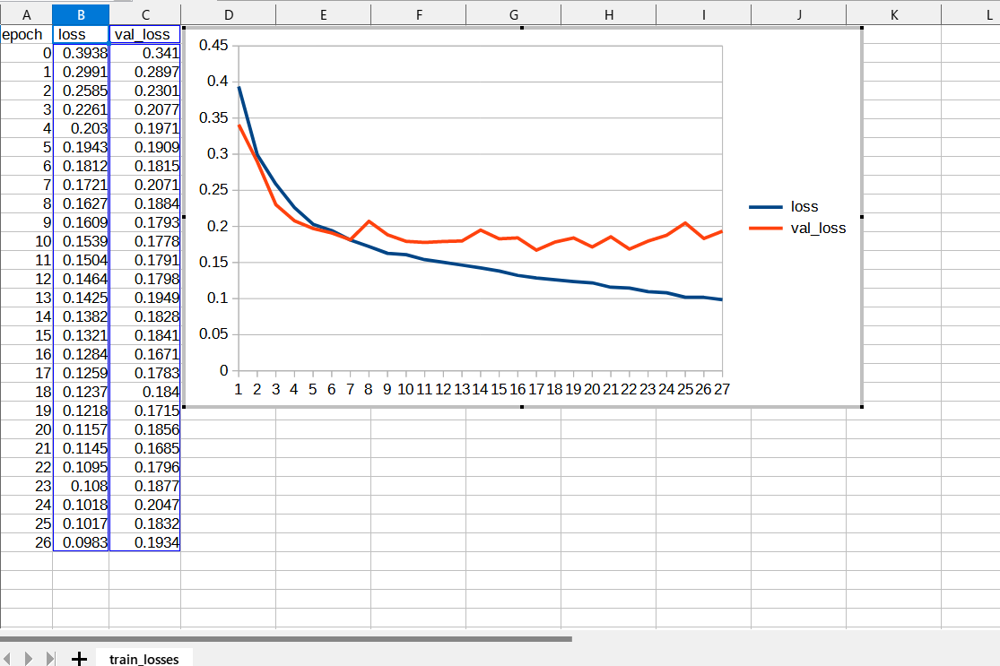
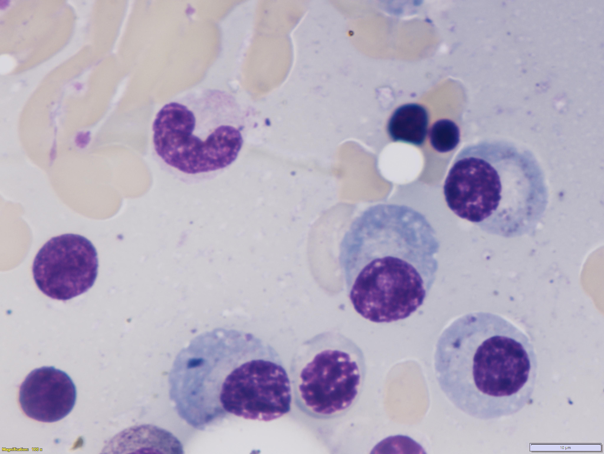
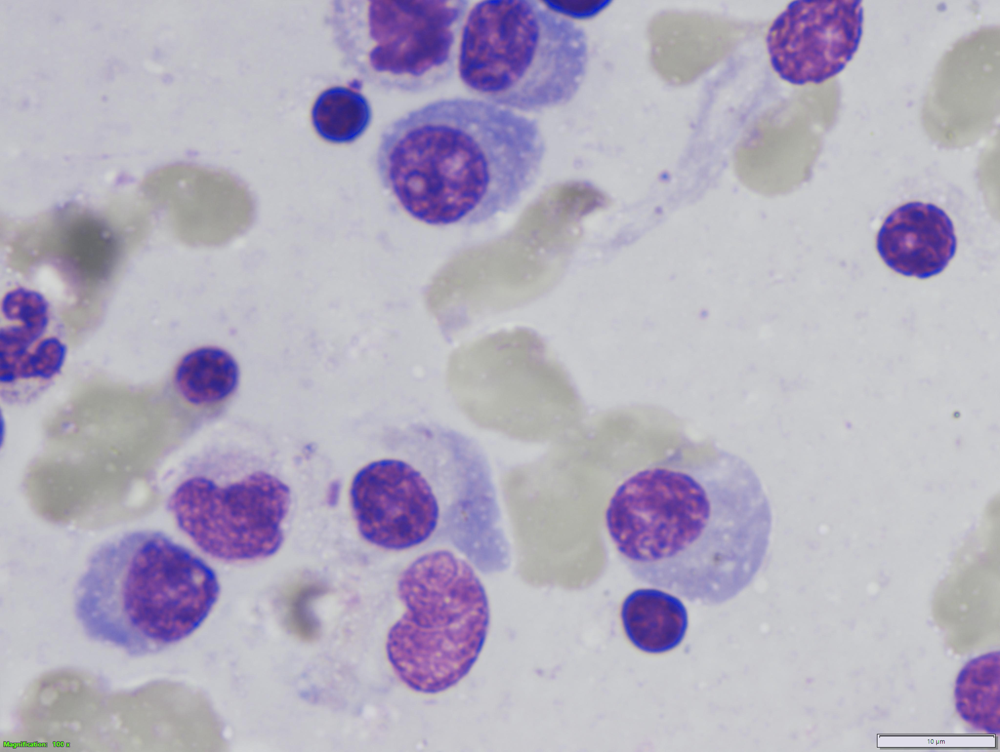

<h2>Tensorflow-Image-Segmentation-MultipleMyeloma(2024/03/09)</h2>

This is the third experimental Image Segmentation project for MultipleMyeloma based on
the <a href="https://github.com/sarah-antillia/Tensorflow-Image-Segmentation-API">Tensorflow-Image-Segmentation-API</a>, and
<a href="https://drive.google.com/file/d/1gqmN7t9kkLMpn0xM8fOhBsv3T3-Ea64X/view?usp=sharing">Augmented-MultipleMyeloma-ImageMask-Dataset_V5.zip</a>
 
 
<b>Segmentation samples.</b> 
<table>
<tr>
<td>
Inferred 4k_mini_test_merged/605.jpg 

</td> 
<td>
Inferred 4k_mini_test_merged/2405.jpg 

</td> 

</tr>

</table>
 
 In order to improve segmentation accuracy, we will use 
 <a href="https://drive.google.com/file/d/1gqmN7t9kkLMpn0xM8fOhBsv3T3-Ea64X/view?usp=sharing">Augmented-MultipleMyeloma-ImageMask-Dataset_V5.zip</a>. 
, which is a <b>Pre-Augmented 640x640 pixel-size Dataset.</b>
 
 
In this experimet, we use the simple UNet Model 
<a href="./src/TensorflowUNet.py">TensorflowSlightlyFlexibleUNet</a> for this MultipleMyeloma Segmentation. 
 
Please see also our online dataset augmentation experiment 
<a href="https://github.com/sarah-antillia/Tensorflow-Image-Segmentation-Augmented-MultipleMyeloma">Tensorflow-Image-Segmentation-Augmented-MultipleMyeloma</a>
, which uses a tiny ImageMask-Dataset of 512x512 pixel-size <a href="https://drive.google.com/file/d/1QiGah4_0yY-5B7s2kIZ2AjbEVu2ejB3G/view?usp=sharing">MultipleMyeloma-ImageMask-Dataset_V2_X.zip</a>. 

<h3>1. Dataset Citation</h3>
The original dataset used here has been take from the following  web site:  
<b>SegPC-2021-dataset</b> 
SegPC-2021: Segmentation of Multiple Myeloma Plasma Cells in Microscopic Images 
<pre>
https://www.kaggle.com/datasets/sbilab/segpc2021dataset
</pre>

<b>Citation:</b> 

<pre>
Anubha Gupta, Ritu Gupta, Shiv Gehlot, Shubham Goswami, April 29, 2021, "SegPC-2021: Segmentation of Multiple Myeloma Plasma Cells 
in Microscopic Images", IEEE Dataport, doi: https://dx.doi.org/10.21227/7np1-2q42.

BibTex
@data{segpc2021,
doi = {10.21227/7np1-2q42},
url = {https://dx.doi.org/10.21227/7np1-2q42},
author = {Anubha Gupta; Ritu Gupta; Shiv Gehlot; Shubham Goswami },
publisher = {IEEE Dataport},
title = {SegPC-2021: Segmentation of Multiple Myeloma Plasma Cells in Microscopic Images},
year = {2021} }

IMPORTANT:
If you use this dataset, please cite below publications-
1. Anubha Gupta, Rahul Duggal, Shiv Gehlot, Ritu Gupta, Anvit Mangal, Lalit Kumar, Nisarg Thakkar, and Devprakash Satpathy, 
 "GCTI-SN: Geometry-Inspired Chemical and Tissue Invariant Stain Normalization of Microscopic Medical Images," 
 Medical Image Analysis, vol. 65, Oct 2020. DOI: 
 (2020 IF: 11.148)
2. Shiv Gehlot, Anubha Gupta and Ritu Gupta, 
 "EDNFC-Net: Convolutional Neural Network with Nested Feature Concatenation for Nuclei-Instance Segmentation,"
 ICASSP 2020 - 2020 IEEE International Conference on Acoustics, Speech and Signal Processing (ICASSP), 
 Barcelona, Spain, 2020, pp. 1389-1393.
3. Anubha Gupta, Pramit Mallick, Ojaswa Sharma, Ritu Gupta, and Rahul Duggal, 
 "PCSeg: Color model driven probabilistic multiphase level set based tool for plasma cell segmentation in multiple myeloma," 
 PLoS ONE 13(12): e0207908, Dec 2018. DOI: 10.1371/journal.pone.0207908

License
CC BY-NC-SA 4.0
</pre>

<h3>
<a id="2">
2 MultipleMyeloma ImageMask Dataset
</a>
</h3>
 If you would like to train this MultipleMyelomaSegmentation model by yourself,
 please download the dataset from the google drive 
<a href="https://drive.google.com/file/d/1gqmN7t9kkLMpn0xM8fOhBsv3T3-Ea64X/view?usp=sharing">Augmented-MultipleMyeloma-ImageMask-Dataset_V5.zip</a>
 

On that dataset, please see also <a href="https://github.com/sarah-antillia/MultipleMyeloma-ImageMask-Dataset">MultipleMyeloma-ImageMask-Dataset</a>
 
Please expand the downloaded ImageMaskDataset and place them under <b>./dataset</b> folder to be

<pre>
./dataset
└─MultipleMyeloma
    ├─train
    │  ├─images
    │  └─masks
    └─valid
        ├─images
        └─masks
</pre>
 
 
<b>MultipleMyelomaDataset Statistics</b> 
 
 
<b>train/image samples</b> 
 
<b>train/mask samples</b> 
 

 

<h3>
<a id="3">
3 TensorflowSlightlyFlexibleUNet
</a>
</h3>
This <a href="./src/TensorflowUNet.py">TensorflowUNet</a> model is slightly flexibly customizable by a configuration file. 
For example, <b>TensorflowSlightlyFlexibleUNet/MultipleMyeloma</b> model can be customizable
by using <a href="./projects/TensorflowSlightlyFlexibleUNet/Augmented-MultipleMyeloma/train_eval_infer.config">train_eval_infer.config</a>
<pre>
; train_eval_infer.config
; Augmented-MultipleMyeloma-ImageMask-Dataset_V5
; 
; 2024/03/9 (C) antillia.com
; generator    = False
;image_width    = 640
;image_height   = 640

[model]
model          = "TensorflowUNet"
generator      =  False
image_width    = 640
image_height   = 640
image_channels = 3
num_classes    = 1
base_filters   = 16
base_kernels   = (5,5)
num_layers     = 6
dropout_rate   = 0.08
learning_rate  = 0.0001
clipvalue      = 0.5
dilation       = (2,2)
;loss           = "bce_iou_loss"
loss           = "bce_dice_loss"
metrics        = ["binary_accuracy"]
show_summary   = False

[train]
epochs        = 100
batch_size    = 2
steps_per_epoch  = 200
validation_steps = 100
patience      = 10
;metrics       = ["iou_coef", "val_iou_coef"]
metrics       = ["binary_accuracy", "val_binary_accuracy"]
model_dir     = "./models"
eval_dir      = "./eval"
image_datapath = "../../../dataset/MultipleMyeloma/train/images/"
mask_datapath  = "../../../dataset/MultipleMyeloma/train/masks/"
create_backup  = False
learning_rate_reducer = False
save_weights_only = True

[eval]
image_datapath = "../../../dataset/MultipleMyeloma/valid/images/"
mask_datapath  = "../../../dataset/MultipleMyeloma/valid/masks/"

[infer] 
images_dir    = "../../../4k_mini_test"
output_dir    = "./4k_mini_test_output"
merged_dir    = "./mini_test_output_merged"

[tiledinfer] 
overlapping = 64
images_dir = "../../../4k_mini_test"
output_dir = "./4k_tiled_mini_test_output"
merged_dir = "./4k_tiled_mini_test_output_merged"

[segmentation]
colorize      = False
black         = "black"
white         = "green"
blursize      = None

[mask]
blur      = True
blur_size = (3,3)
binarize  = True
#threshold = 128
threshold = 74
</pre>
 
Please note that the image_size of this model is slightly large as shown below: 
<pre>
[model]
image_width    = 640
image_height   = 640
</pre>

<h3>
3.1 Training
</h3>
Please move to a <b>./projects/TensorflowSlightlyFlexibleUNet/MultipleMyeloma</b> folder, 
and run the following bat file to train TensorflowUNet model for MultipleMyeloma. 
<pre>
./1.train.bat
</pre>
, which simply runs <a href="./src/TensorflowUNetTrainer.py">TensorflowUNetTrainer.py </a>
in the following way.

<pre>
python ../../../src/TensorflowUNetTrainer.py ./train_eval_infer.config
</pre>
Train console output: 
 
 
Train metrics: 
 
 
Train losses: 
 
 

<h3>
3.2 Evaluation
</h3>
Please move to a <b>./projects/TensorflowSlightlyFlexibleUNet/Augmented-MultipleMyeloma</b> folder, 
and run the following bat file to evaluate TensorflowUNet model for MultipleMyeloma. 
<pre>
./2.evaluate.bat
</pre>
<pre>
python ../../../src/TensorflowUNetEvaluator.py ./train_eval_infer.config
</pre>
This evalutes loss and accuray for test dataset specified [eval] section. 
<pre>
[eval] 
image_datapath = "../../../dataset/MultipleMyeloma/eval/images/"
mask_datapath  = "../../../dataset/MultipleMyeloma/eval/masks/"
</pre>
Evaluation console output: 

 

<pre>
Test loss    :0.1758
Test accuracy:0.961899995803833
</pre>
As shown above, the loss score is a little bit lower (better) than that of our experiment.
 
  
<h2>
3.3 Inference
</h2>
Please move to a <b>./projects/TensorflowSlightlyFlexibleUNet/MultipleMyeloma</b> folder 
,and run the following bat file to infer segmentation regions for images by the Trained-TensorflowUNet model for MultipleMyeloma. 
<pre>
./3.infer.bat
</pre>
<pre>
python ../../../src/TensorflowUNetInferencer.py ./train_eval_infer_aug.config
</pre>
4k_mini test images 
 
<!--
Sample test mask (ground_truth) 
 
-->
 
Inferred 4k_mini_test masks 
 
 
Merged test 4k_images and inferred masks  
  

Enlarged samples 
<table>

<tr>
<td>
4k_mini_test/605.jpg 

</td>
<td>
Inferred 4k_mini_test_merged/605.jpg 

</td> 
</tr>

<tr>
<td>
4k_mini_test/1735.jpg 

</td>
<td>
Inferred 4k_mini_test_merged/1735.jpg 

</td> 
</tr>

<tr>
<td>
4k_mini_test/1923.jpg 

</td>
<td>
Inferred 4k_mini_test_merged/1923.jpg 

</td> 
</tr>

<tr>
<td>
4k_mini_test/2123.jpg 

</td>
<td>
Inferred 4k_mini_test_merged/2123.jpg 

</td> 
</tr>

<tr>
<td>
4k_mini_test/2405.jpg 

</td>
<td>
Inferred 4k_mini_test_merged/2123.jpg 

</td> 
</tr>

</table>

<h3>
References
</h3>
<b>1. SegPC-2021-dataset</b> 
SegPC-2021: Segmentation of Multiple Myeloma Plasma Cells in Microscopic Images 
<pre>
https://www.kaggle.com/datasets/sbilab/segpc2021dataset
</pre>
Citation: 
<pre>
Anubha Gupta, Ritu Gupta, Shiv Gehlot, Shubham Goswami, April 29, 2021, "SegPC-2021: Segmentation of Multiple Myeloma Plasma Cells 
in Microscopic Images", IEEE Dataport, doi: https://dx.doi.org/10.21227/7np1-2q42.
BibTex
@data{segpc2021,
doi = {10.21227/7np1-2q42},
url = {https://dx.doi.org/10.21227/7np1-2q42},
author = {Anubha Gupta; Ritu Gupta; Shiv Gehlot; Shubham Goswami },
publisher = {IEEE Dataport},
title = {SegPC-2021: Segmentation of Multiple Myeloma Plasma Cells in Microscopic Images},
year = {2021} }
IMPORTANT:
If you use this dataset, please cite below publications-
1. Anubha Gupta, Rahul Duggal, Shiv Gehlot, Ritu Gupta, Anvit Mangal, Lalit Kumar, Nisarg Thakkar, and Devprakash Satpathy, 
 "GCTI-SN: Geometry-Inspired Chemical and Tissue Invariant Stain Normalization of Microscopic Medical Images," 
 Medical Image Analysis, vol. 65, Oct 2020. DOI: 
 (2020 IF: 11.148)
2. Shiv Gehlot, Anubha Gupta and Ritu Gupta, 
 "EDNFC-Net: Convolutional Neural Network with Nested Feature Concatenation for Nuclei-Instance Segmentation,"
 ICASSP 2020 - 2020 IEEE International Conference on Acoustics, Speech and Signal Processing (ICASSP), 
 Barcelona, Spain, 2020, pp. 1389-1393.
3. Anubha Gupta, Pramit Mallick, Ojaswa Sharma, Ritu Gupta, and Rahul Duggal, 
 "PCSeg: Color model driven probabilistic multiphase level set based tool for plasma cell segmentation in multiple myeloma," 
 PLoS ONE 13(12): e0207908, Dec 2018. DOI: 10.1371/journal.pone.0207908
License
CC BY-NC-SA 4.0
</pre>

<b>2. Deep Learning Based Approach For MultipleMyeloma Detection</b> 
Vyshnav M T, Sowmya V, Gopalakrishnan E A, Sajith Variyar V V, Vijay Krishna Menon, Soman K P 
<pre>
https://www.researchgate.net/publication/346238471_Deep_Learning_Based_Approach_for_Multiple_Myeloma_Detection
</pre>
 

<b>3. Image-Segmentation-Multiple-Myeloma</b> 
Toshiyuki Arai @antillia.com 
<pre>
https://github.com/atlan-antillia/Image-Segmentation-Multiple-Myeloma
</pre>
 

<b>4. Tensorflow-Image-Segmentation-Augmented-MultipleMyeloma</b> 
Toshiyuki Arai @antillia.com 
<pre>
https://github.com/sarah-antillia/Tensorflow-Image-Segmentation-Augmented-MultipleMyeloma
</pre>
 

